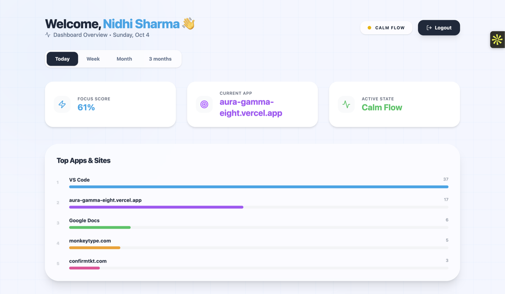

# Aura 🌟
> Understand your productivity without saying a word.

[](https://github.com/nidhi333-9/aura/actions/workflows/ci.yml)

Aura is a productivity tracker that quietly notes which app or website is in front of you, labels each moment Productive, Neutral or Distraction, and turns that into a live focus score and history charts, so you can see when you focus best. You stay in control: you can see what is stored and delete it, or your whole account, at any time.

## 🖥️ Preview



## 🌐 Live Demo

🔗 https://aura-gamma-eight.vercel.app  
📦 https://github.com/nidhi333-9/aura

## ✨ Features

- Live Focus Score from the apps and websites you use (the last 30 minutes)  
- Recognises sites and apps (GitHub, LeetCode, LinkedIn, YouTube, VS Code...) and labels them with simple, readable rules  
- Today's focus trend, by hour  
- Week, Month and 3-month history: daily focus, best weekday, an hour-by-weekday heatmap and time breakdown  
- A focus state from your recent score (Deep Focus, Calm Flow, Low Energy)  
- Music to match your focus state (YouTube videos and a Spotify player)  
- Your data, your control: see what is held, delete it or your account  
- Desktop sensor for macOS (Apple Silicon; an Intel build is set up but not yet published) and Windows (early support)

## 🎨 UI/UX Highlights

- Minimal and distraction-free dashboard  
- Smooth real-time updates  
- Designed for actionable insights, not data overload

## 🛠️ Tech Stack

- Frontend: React + Vite + TailwindCSS  
- Backend: Node.js + Express  
- ML Service (experimental, not used by the product): Python + FastAPI  
- Database: MongoDB  
- Desktop Agent: Python + PyInstaller  
- Hosting: Vercel (dashboard) + Render (backend; the experimental ML service can stay off) + MongoDB Atlas

## ⚙️ How It Works

1. The desktop sensor looks at your front window every 10 seconds (on a Mac, also which website your browser is on)  
2. It sends that to the backend with its own device key; the backend labels each moment Productive, Neutral, Distraction or Idle and stores it  
3. The dashboard turns those labels into a live focus score, today's chart and week, month and 3-month history  
4. The `ml-service/` folder is experimental: nothing calls it any more and the score and charts do not need it (see [ml-service/README.md](ml-service/README.md))  

The full picture, with diagrams, is in **[docs/ARCHITECTURE.md](docs/ARCHITECTURE.md)**.

## 🚀 Getting Started

1. Visit: https://aura-gamma-eight.vercel.app  
2. Login with Google  
3. Open **Connect a sensor** on the dashboard and copy the install command (it contains a one-time pairing code, not your login)  
4. Paste it into Terminal (macOS) or PowerShell (Windows). The sensor pairs itself and starts running  
5. **On a Mac, allow two things once** (the dashboard shows the steps under the install command): System Settings →
   Privacy & Security → *Accessibility* → turn on Terminal, and *Automation* → under Terminal turn on *System Events*
   and your browser. Without them macOS hides window titles, and the dashboard and the sensor both say so  
6. Start tracking your productivity in real time. Manage or remove paired devices under **Your devices**

## 💻 Local Development

### Prerequisites
- Node.js 18+
- Python 3.11+
- MongoDB (running locally)

### Local settings: do this first

> **Warning:** on a developer machine the `.env` files often hold the **production** database and the live
> backend URL. Running the steps below with only those files means local code reads and writes real data, and
> the dev server (including Google login) talks to the live site.

Keep your local values in `.env.local` files instead. They override `.env`, are git-ignored, and each has an
`.env.example` to copy:

```bash
cp backend/.env.example     backend/.env.local      # local MongoDB + local secrets
cp ml-service/.env.example  ml-service/.env.local   # local MongoDB (only for the experimental ML service)
cp frontend/.env.example    frontend/.env.local     # VITE_API_URL=http://localhost:8080
```

Order of precedence everywhere: real environment variables, then `.env.local`, then `.env`. In production neither
file normally exists, so nothing changes there. On start the backend logs which files it loaded and whether the
database is local or **REMOTE** (with a warning if it's remote outside production), so a mix-up is hard to miss.

### Backend
cd backend  
npm install  
node server.js  

### Frontend
cd frontend  
npm install  
npm run dev  

### ML Service (experimental, optional: nothing needs it)
cd ml-service  
pip install -r requirements.txt  
uvicorn api:app --reload  

### Sensor
cd tracker  
pip install pywinctl requests  
AURA_PAIR_CODE=ABCDE-FGHJK python sensor.py  

Get the code from **Connect a sensor** on the dashboard (valid for 10 minutes, single use). It is only needed the
first time: the sensor trades it for its own device key, saved to `~/.aura/device.json`, and reuses that on later runs.
Without `AURA_PAIR_CODE` it asks for a code when it starts. To point it at a local backend, also set
`AURA_API_URL=http://localhost:8080` (a saved key is only ever sent to the server that issued it).

If you remove the device in the dashboard, the sensor says so and exits; run a fresh install command to connect it again.

**Which website you are on (macOS).** A window title doesn't always name the site, so for Chrome, Brave, Edge,
Safari, Arc, Vivaldi, Opera and Chromium the sensor also asks the browser which address its front tab is on.
Only the **host name** is sent (`linkedin.com`), never the path, query or page content, and private/incognito
windows are skipped. The first time, macOS asks whether your terminal may control the browser; if you say no, or
use Firefox or Windows, nothing breaks: Aura falls back to guessing the site from the window title. If you said no
and change your mind: System Settings → Privacy & Security → Automation → turn the browser on under your terminal app.
The host is stored with each sample so a rule change can relabel old data (`backfill-classification.js --apply --force`).

## 🔒 Privacy

The sensor sends the app in front, its window title, on a Mac the website's host name (never the full address), and
the time. Before saving, the server hides login tokens and everything after `?` or `#` in an address
(`backend/services/privacy.js`). On the dashboard, **Your data** shows what is held and can delete all tracked data or
the whole account (`DELETE /api/account/data`, `DELETE /api/account`; both need `{"confirm":"DELETE"}`, and deleting an
account also removes its devices so their sensors stop). Samples (which hold the window titles) are deleted by the
database after 30 days (`scripts/enable-raw-ttl.js`); the daily summaries behind the history charts hold only counts and
are kept. The plain-language notice is the `/privacy` page
(`frontend/src/components/Privacy.jsx`): update it whenever what is collected or kept changes.

To clean titles that were saved before the cleaner existed, run once from `backend/` (dry run first):

```bash
node scripts/redact-titles.js
node scripts/redact-titles.js --apply
```

## 🔐 Environment Variables

### Backend
MONGO_URI=  
JWT_SECRET= (required — the server refuses to start without it)  
YOUTUBE_API_KEY=  
PAIR_CODE_TTL_SECONDS= (optional, default 600: how long a sensor pairing code stays valid)  
TRUST_PROXY_HOPS= (optional, default 3, measured for Render: how many proxies Express believes when it works out a caller's address; check with `GET /api/network-check`, see docs/ARCHITECTURE.md)  
RATE_LIMIT_DISABLED= (optional: `true` switches every request limit off)  

### ML Service (experimental, suspended in Render: these are needed only if you resume it)
MONGO_URI= (use a read-only database user — the ML service never writes)  
ML_SHARED_SECRET= (required — every request without this secret is rejected)  

### Frontend
VITE_API_URL=  

## 📦 Deployment

- Frontend → Vercel  
- Backend → Render  
- ML Service → Render (optional; nothing uses it, so it can stay switched off)  
- Database → MongoDB Atlas  

How the pieces connect, who may call what, and the everyday jobs (releasing a sensor, rebuilding summaries) are in
[docs/ARCHITECTURE.md](docs/ARCHITECTURE.md).

### Deploying

* **Website (Vercel)** deploys by itself when `main` changes.
* **Backend (Render)** is deployed by GitHub, not by Render's own watcher. After the backend tests pass on a push to
  `main`, the `deploy` job in `.github/workflows/ci.yml` calls Render's deploy hook for **that exact commit**, then waits
  until the live `GET /api/version` shows it. A deploy that never goes live turns the run red instead of passing quietly.

One-time setup (the hook URL is private: paste it only into GitHub's secret box, never into a chat or a file):

1. Render, the `aura-backend` service, **Settings → Deploy → Deploy Hook**: show it and copy the URL.
2. GitHub, this repository, **Settings → Secrets and variables → Actions → New repository secret**:
   name `RENDER_DEPLOY_HOOK`, value the URL.
3. Render, **Settings → Deploy → Auto-Deploy**: set it to **Off**, so one push is not deployed twice.

If the secret is missing, the run shows a yellow warning and deploys nothing. To check by hand whether the live backend is
current: `cd backend && node scripts/check-deploy.js`. A manual deploy always works too (Render: **Manual Deploy → Deploy
latest commit**). If the hook URL ever leaks, press **Regenerate hook** in Render and update the GitHub secret.

### After deploying the classify-at-ingest change

New activity is labelled (`site`, `category`) when it arrives. To label rows recorded before that, run once
(from `backend/`, with `MONGO_URI` pointing at the real database):

```bash
node scripts/backfill-classification.js           # dry run: shows what would change
node scripts/backfill-classification.js --apply   # writes the labels
```

It is safe to re-run. Use `--apply --force` to relabel every row after editing a rule in `services/classify.js`.
The dashboard works before the backfill too (unlabelled rows are classified on the fly).

### Long-term history: rollups and raw-data expiry

Every sensor sample is stored as a raw row (with its window title) **and** counted in a tiny permanent
daily summary (`daily_stats`, one document per user per day, in 15-minute slots so it works for any
time zone). History charts can read the summaries, which is what makes the **3 months** tab possible and
lets old raw rows expire. Nothing below happens by itself, and nothing is deleted until the last step.
Run these from `backend/` with `MONGO_URI` pointing at the real database:

1. **Deploy the backend.** It starts counting new samples into the summaries. History keeps reading raw
   data, so nothing changes yet, and the 3-month tab says it isn't available yet.
2. **Wait for one sensor sample** (this records that the backend is writing summaries).
3. **Build and verify the summaries** (safe, repeatable):
   ```bash
   node scripts/rebuild-rollups.js           # dry run: shows what it found
   node scripts/rebuild-rollups.js --apply   # rebuilds, re-reads raw to verify, then marks them ready
   ```
   History switches to the summaries immediately (no restart) and the 3-month tab works. If it says
   "NOT marking ready", it tells you why (usually: step 1 or 2 hasn't happened yet). To go back to raw
   data: `node scripts/rebuild-rollups.js --apply --disable`.
4. **Optional, and the only step that deletes anything: expire old raw samples.**
   ```bash
   node scripts/enable-raw-ttl.js                      # dry run: re-verifies everything, says how many rows would go
   node scripts/backup.js                              # first: saves a copy of the database to ~/aura-backups (read-only)
   node scripts/enable-raw-ttl.js --days 30 --apply
   ```
   It refuses unless the summaries match the raw rows exactly. The summaries (all the charts need) are kept
   forever; individual samples and their window titles older than 30 days are deleted, which is also good
   for privacy. If you want old titles for ML labelling, run `ml-service/training/build_dataset.py` first.
   To stop expiring: `node scripts/enable-raw-ttl.js --disable --apply` (deleted rows are not restored; `mongorestore` of the
   backup brings them back, with expiry switched off first). After samples have expired, `rebuild-rollups.js` never
   recomputes a day whose raw samples are gone, so the daily summaries (the permanent history) can't be overwritten with less.

After `backfill-classification.js --force` (relabelling existing rows), run `rebuild-rollups.js --apply` again.
If a rollup write ever fails at ingest the sample is still saved; `rebuild-rollups.js --apply --days 3`
repairs recent drift.

### Tests

```bash
cd backend && npm test
cd tracker && python -m unittest test_sensor -v   # needs: pip install pywinctl requests
cd frontend && npm run lint && npm run build
```

GitHub runs all of these automatically on every push and pull request (`.github/workflows/ci.yml`), plus a package
audit that warns but never blocks. The result is the badge at the top of this page and the **Actions** tab.

## 💾 Backups

The free Atlas database has no automatic backups, and the daily summaries are the only long-term record of your
history, so Aura makes its own. From `backend/` (needs `brew install mongodb-database-tools`):

```bash
node scripts/backup.js                       # one backup now, saved in ~/aura-backups (read-only; private to your user)
bash scripts/schedule-backup.sh install      # automatic: checks every evening, backs up when the newest is 6+ days old
bash scripts/schedule-backup.sh status       # is it running, how old is the newest backup, last lines of the log
```

The schedule keeps the newest 12 backups (about three months) and runs only while the Mac is on; a night it was off
or offline is retried the next night. `schedule-backup.sh run-now` tries it immediately and `remove` takes it away.
To check that a backup works, restore it into a *different* database name and compare:

```bash
mongorestore --gzip --uri="mongodb://127.0.0.1:27017" --nsFrom "aura.*" --nsTo "aura_restored.*" ~/aura-backups/<folder>
```

To bring real data back, restore into the real database (switch raw-sample expiry off first, or the old samples are
deleted again). Backups hold everyone's window titles: keep them private and never put them inside the project folder
(the script refuses to). They live only on this Mac, so copy the folder somewhere else now and then.

## 👩‍💻 Author

**Nidhi Sharma**

- GitHub: https://github.com/nidhi333-9  
- LinkedIn: https://www.linkedin.com/in/techynidhi3/
