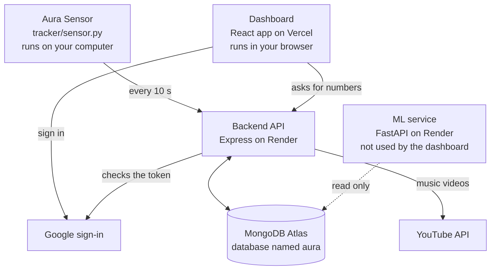
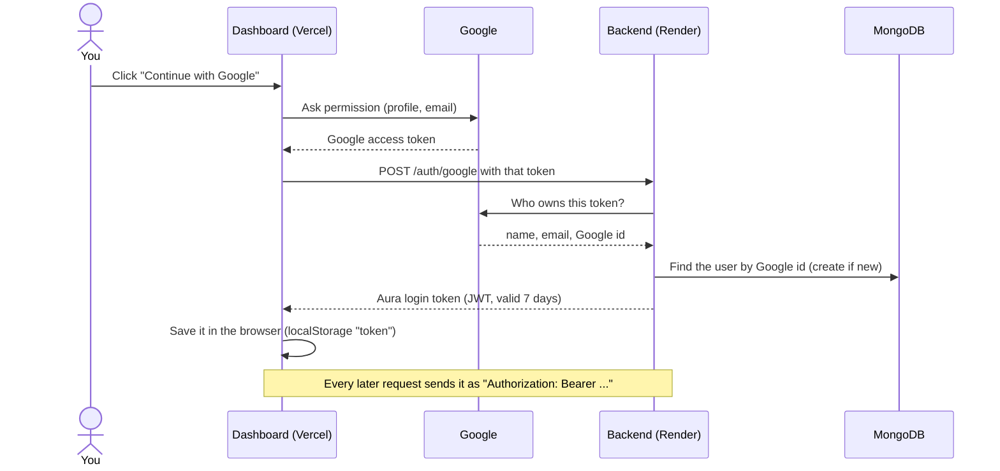
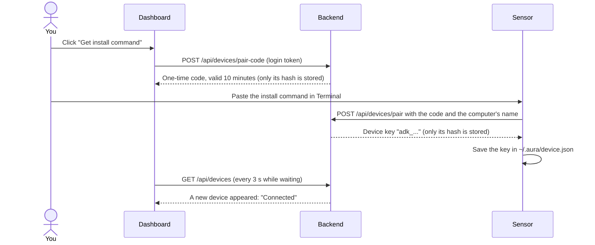
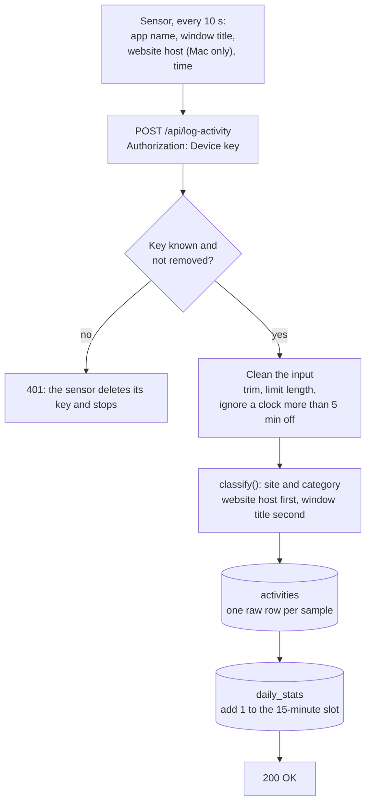
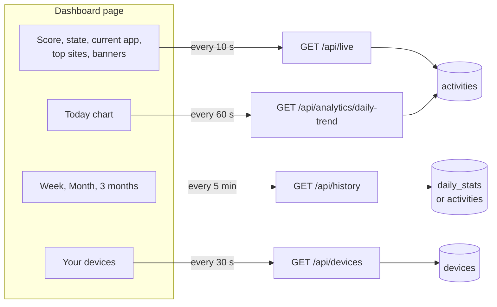
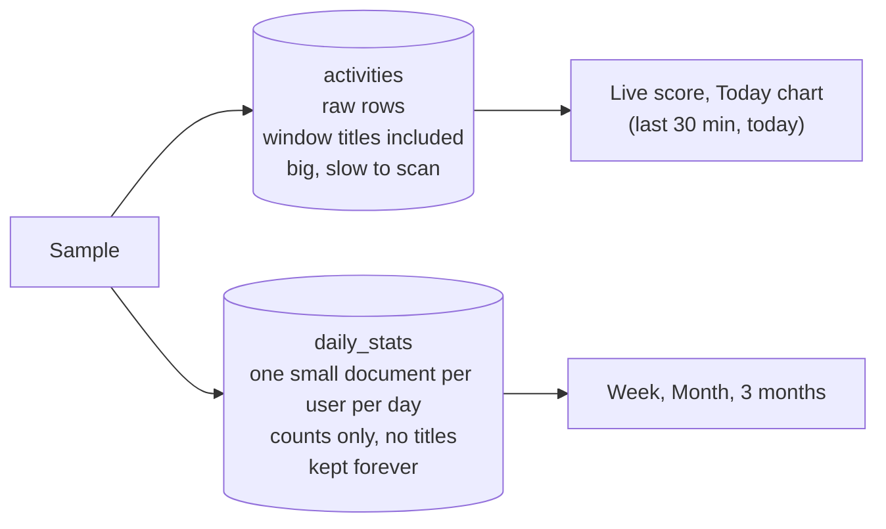

# How Aura works

This page explains how the parts of Aura fit together, in plain words. Read it top to bottom once,
then use it as a map: every section says where the code lives.

**In one sentence:** a small program on your computer (the *sensor*) tells the server every 10 seconds
which window you have open; the server labels each moment as *Productive*, *Neutral*, *Distraction* or
*Idle*; the dashboard turns those labels into a focus score and charts.

## 1. The big picture



| Part | Folder | What it is | Where it runs |
| --- | --- | --- | --- |
| Sensor | `tracker/` | Python program. Looks at the front window every 10 seconds and reports it. | Your computer (Mac, Windows) |
| Dashboard | `frontend/` | React + Vite + Tailwind + Recharts. Shows the score and the charts. | Vercel |
| Backend | `backend/` | Express + Mongoose. The only part that **writes** to the database. | Render |
| Database | n/a | MongoDB Atlas, database `aura`. | Atlas |
| ML service | `ml-service/` | FastAPI + pandas. **Read only.** Today it is not on the dashboard's path; it only serves an old route and some training scripts. | Render |

Two rules the project follows:

1. **The backend is the only writer.** The sensor, the dashboard and the ML service never touch the
   database directly.
2. **The server decides what things mean.** The score, the state ("Deep Focus"), the category of each
   site: all decided once, on the server. The dashboard only draws what it is told.

## 2. Signing in



* One Google account is always one Aura account (matched by Google's id).
* The login token is signed with `JWT_SECRET`. The backend **refuses to start** without it.
* If the backend ever answers 401, the dashboard deletes the token and goes back to the landing page.
* Code: `backend/routes/auth.js`, `backend/middleware/authMiddleware.js`, `frontend/src/hooks/useAuth.js`.

## 3. Connecting a sensor

The sensor never holds your login. It trades a one-time code for its own key.



* A code works once and dies after 10 minutes. You can only have one live code at a time.
* The **device key** can do one thing: send samples to `POST /api/log-activity`. It cannot read data,
  list devices or make codes.
* "Remove" next to a device in the dashboard revokes the key. On its next sample the sensor gets a 401,
  deletes its key and stops (it does not retry forever).
* A key is bound to the server that issued it, so a sensor pointed at another address never sends it there.
* A person can have at most 10 active devices.
* Code: `backend/routes/devices.js`, `backend/middleware/ingestAuth.js`, `backend/services/pairing.js`,
  `tracker/sensor.py`, `frontend/src/components/SensorSetup.jsx`.

## 4. The life of one sample

A *sample* is one look at the front window. It happens about every 10 seconds, so about 6 a minute.



Two details worth knowing:

* The raw row is saved **first**. If adding it to `daily_stats` fails, the problem is logged but the sample
  is still kept and the sensor still gets 200. A repair script can fix `daily_stats` later.
* An older sensor that sends no website host still works. The server then guesses from the window title.
* The window title is **cleaned of secrets** before anything else happens: tokens and everything after `?` or `#`
  in an address are replaced with `[hidden]` (`backend/services/privacy.js`). Ordinary titles are never changed.

Code: `backend/routes/activity.js`, `backend/services/classify.js`, `backend/services/rollups.js`.

### How a sample gets its label

`classify(appName, windowTitle, domain)` returns a **site** (what the dashboard shows) and a **category**
(what the score uses).

| Situation | What happens |
| --- | --- |
| A desktop app (VS Code, Terminal, Spotify...) | Looked up by app name. Windows names like `Code.exe` are treated the same as `Code`. |
| A browser, and the sensor sent a website host | Known host (`linkedin.com`) gives the site name. An unknown host is shown as itself (`prabhupada.world`), category Neutral. |
| A browser, no host (Firefox, Windows, old sensor) | The window title is cleaned (browser name, profile, "High memory usage" removed) and matched against keywords. The site name at the **end** of the title wins over words inside it. No match: "Other website". |
| Desktop, lock screen, no window | **Idle**. Idle samples are ignored everywhere. |

The four categories: **Productive** (code editors, GitHub, LeetCode, docs...), **Neutral** (default; LinkedIn,
Gmail...), **Distraction** (YouTube, Netflix, Instagram...), **Idle**. The lists live in one file,
`backend/services/classify.js`, so changing a rule is a one-file change plus a test.

On Mac the sensor gets the website host by asking the browser for its front tab's address. It sends **only
the host name**, never the path or query, and skips private windows. This needs the Mac permissions
described in the README. Without them everything still works; it just guesses from titles.

## 5. What the dashboard shows, and where each number comes from



The page appears at once; each card loads on its own and shows its own "loading" or "couldn't load" message.
Polling pauses while the tab is hidden and refreshes the moment you come back.

| Number | Rule |
| --- | --- |
| **Focus score** | Productive samples ÷ non-idle samples, over the **last 30 minutes**, as a whole percent. |
| **State** | Above 70 is *Deep Focus*, above 40 is *Calm Flow*, otherwise *Low Energy*. Decided on the server. |
| **Sensor online** | The newest sample is at most 60 seconds old. |
| **Today chart** | 24 hourly bars in **your** time zone (the browser sends `?tz=`). An hour with no data is empty, not 0%. |
| **Week / Month / 3 months** | A day counts only with at least 30 tracked minutes. "Best weekday" needs at least 2 weekdays with 3 counted days each. "Peak hour" needs at least 20 minutes. |

Code: `backend/routes/live.js`, `backend/services/focus.js`, `backend/services/history.js`,
`frontend/src/hooks/useResource.js` (the polling), `frontend/src/components/`.

### The sleeping server

On the free Render plan the backend falls asleep after about 15 minutes without requests and needs
about a minute to wake. While your sensor runs it keeps the backend awake. When you open the dashboard
after a quiet period, the first load waits up to 90 seconds and the page says "Waking up the server".

## 6. Raw samples and daily summaries

Storing every sample forever would fill a free database, and scanning months of them is slow. So there
are two layers:



* A `daily_stats` document counts samples in **15-minute slots** per category. 15 minutes is chosen on
  purpose: every time zone's offset from UTC is a multiple of 15 minutes, so one set of summaries is
  exact for a viewer in any zone (even Nepal's +5:45).
* `/api/history` reads the summaries only when `meta` "rollups" says `ready: true`. Before that it reads raw
  data (and the 3-month range answers "not available yet").
* Once raw samples start to expire, the summaries are the **only** record of those days. `rebuild-rollups.js` therefore
  never recomputes a day whose raw samples are gone: it works that out from the data (the expiry rule exists, or was ever
  enabled, or summaries exist for days older than the oldest raw sample), so switching the rule off or changing its
  period cannot make a rebuild overwrite history with less (`firstCompleteDay` in `backend/services/rollupBuild.js`).
* **`ready` is set by a script, not automatically**, because the script first rebuilds the summaries,
  re-reads the raw data and checks they match exactly. That is why the "3 months" tab needed a one-time command.

Code: `backend/services/rollups.js`, `backend/services/rollupBuild.js`, `backend/models/DailyStat.js`,
`backend/models/Meta.js`.

## 7. The database

Database `aura` on MongoDB Atlas. Mongoose names the collections.

| Collection | One document is | Notes |
| --- | --- | --- |
| `users` | A person | `googleId` (unique), email, name, picture. |
| `devices` | A paired sensor | Owner, name, OS, **hash** of the key, `lastSeen`, `revokedAt`. The key itself is never stored. |
| `pairingcodes` | A pending code | **Hash** of the code, expiry, used or not. MongoDB deletes expired ones by itself. |
| `activities` | One sample | Owner, app, window title, website host, site, category, time. Index on owner + time. |
| `daily_stats` | One user on one UTC day | Counts per 15-minute slot. Unique per user and day. |
| `meta` | Settings | One document, `rollups`: `liveSince`, `ready`, `builtAt`. |

Raw `activities` rows currently **never expire**. A separate, deliberately manual script can make them
expire (see section 10).

## 8. Who is allowed to do what

| Caller | Proves who it is with | Can do |
| --- | --- | --- |
| Dashboard | Login token (JWT, 7 days) | Read its own numbers, make pairing codes, list and remove its own devices, **delete its own tracked data or its whole account** (`/api/account`, needs the word `DELETE` in the request). |
| Sensor | Device key (`Authorization: Device ...`) | Only `POST /api/log-activity`. |
| Not signed in | Nothing | Sign in; trade a valid one-time code for a device key. |
| ML service | Shared secret header `X-Aura-Secret` | Called only by the backend, never by a browser. |

Every query is filtered by the caller's own user id. CORS only allows the Vercel site and
`http://localhost:5173`. Secrets (`JWT_SECRET`, pairing codes, device keys) are never stored in plain text.

### Request limits

One caller (a bug, a script, an attacker) must not be able to use up the server, the database or the YouTube
quota for everyone. The limits are far above real use (a sensor sends 6 samples a minute; the dashboard makes
roughly 10 to 40 requests a minute). Going over one gives **429** with a `Retry-After` header; the sensor and the
dashboard treat that as "try again soon", never as "you were removed".

| What | Limit | Counted per |
| --- | --- | --- |
| Sensor samples (`POST /api/log-activity`) | 30 a minute | device |
| Dashboard requests (every signed-in route) | 300 a minute | person |
| Deleting data or an account | 10 an hour | person |
| Google sign-in (`POST /auth/google`) | 60 a minute, and 20 rejected ones a minute | network address |
| Pairing (`POST /api/devices/pair`) | 30 a minute, and 10 wrong codes a minute | network address |
| Wrong device keys on ingest | 30 a minute | network address |

Signed-in callers are counted as **that person or device**, not by network address, so a whole class behind one
school connection does not use up each other's allowance. Addresses are used only where nobody is signed in yet,
and those limits are generous so that even if addresses cannot be told apart, real users stay far below them.
Failures are counted separately, so guessing is slow while getting it right the first time is never slowed.

Also: request bodies are capped at 32 KB, and `GET /api/youtube-recommendation` needs a login and only accepts the
three real types (each search costs 100 of the daily YouTube quota, so it must never be triggerable by a made-up value).

Counters live in the server's memory: they reset on a restart, which is right for one server. Code:
`backend/middleware/limits.js` (the numbers are all in `DEFAULTS` at the top).

**Which address is the caller's?** Behind Render's proxies every request arrives from a proxy, so Express must be told
how many proxies to believe (`TRUST_PROXY_HOPS`). This was **measured** on 4 Oct 2026, not guessed: a request reaches
the backend as `X-Forwarded-For: <caller>, <a Cloudflare server>, <Render's balancer>`, plus one more Render proxy that
opens the connection. That is **3** proxies to trust (the default); the caller's address is the first one beyond them.
Anything a caller invents sits further to the left, so it is never believed. With 1 or 2, every caller looks like a
Render or Cloudflare machine (and shares one limit); with 4, a caller could pass an invented address off as their own.

If the host or its setup ever changes, check again: `ip` must be **your own public address** (compare it with what
a service like `curl https://api.ipify.org` says), and an address you invent must never come back as `ip`:

```bash
curl -s https://aura-backend-hmq3.onrender.com/api/network-check
curl -s -H "X-Forwarded-For: 9.9.9.9" https://aura-backend-hmq3.onrender.com/api/network-check
```

`backend/test/limits.test.js` keeps the three real header chains Render sent, so a change to the default fails a test.

## 9. Where it runs, and its settings

| Service | Host | Settings it needs |
| --- | --- | --- |
| Dashboard | Vercel (rebuilds when `main` changes) | `VITE_API_URL`: the backend's address. |
| Backend | Render (redeploys when `main` changes) | `MONGO_URI`, `JWT_SECRET` (required), `ML_SHARED_SECRET`, `YOUTUBE_API_KEY`, optional `PAIR_CODE_TTL_SECONDS`, `TRUST_PROXY_HOPS` (default 3), `RATE_LIMIT_DISABLED` (`true` switches every request limit off). |
| ML service | Render | `MONGO_URI` (use a read-only user), `ML_SHARED_SECRET`. |
| Database | MongoDB Atlas | n/a |
| Sensor builds | GitHub Actions, on a tag like `v1.1.2` | n/a (see below) |

**Local development.** Put your local values in `.env.local` files; they win over `.env`, which on a
developer machine often holds production values. The backend prints which files it loaded and whether the
database is local or **REMOTE**. See the README, "Local settings".

Extras: the dashboard recommends music with the YouTube Data API (cached 1 hour in the backend's memory)
and embeds a Spotify playlist picked by your score in the browser.

## 10. Everyday jobs

| I want to... | Do this |
| --- | --- |
| Ship a code change | Push to `main`. Vercel and Render redeploy by themselves. |
| Ship a new sensor | `git tag v1.2.3` then `git push origin v1.2.3`. GitHub Actions builds the sensor and attaches it to a release. The installers always download the **latest** release. |
| Update my own sensor | Stop it, run the install command again (no code needed, the saved key is reused). |
| Change how sites are labelled | Edit `backend/services/classify.js`, add a test in `backend/test/classify.test.js`, push. New samples use it at once. |
| Relabel old samples too | From `backend/`: `node scripts/backfill-classification.js --apply --force`, **then** `node scripts/rebuild-rollups.js --apply`. |
| Fix or rebuild the daily summaries | `node scripts/rebuild-rollups.js --apply` (repeatable). `--disable` makes history read raw data again. |
| Let old raw samples expire (the only thing that deletes data) | `node scripts/backup.js` (read-only copy to `~/aura-backups`), then `node scripts/enable-raw-ttl.js` as a dry run, then `--days 30 --apply`. |
| Hide secrets in titles that were saved before the cleaner existed | From `backend/`: `node scripts/redact-titles.js` (dry run), then `--apply`. Safe to repeat. |
| Run the tests | `cd backend && npm test`. `cd tracker && python -m unittest test_sensor -v`. |

Deploy order for changes that touch more than one part: **backend first**, then the dashboard, then the
sensor release. Every part is written to tolerate the one before it being old.

## 11. Old pieces that are still there on purpose

These exist only so older installs keep working. Delete them once nothing depends on them.

* `GET /api/analytics` and the `ML_URL` code in `backend/routes/analytics.js`: the old dashboard route that
  asked the ML service first. The current dashboard never calls it. (`GET /api/analytics/daily-trend` in the
  same file **is** used.)
* `GET /dashboard`: returns the last 500 raw rows. Not used by the current dashboard.
* Accepting a login token on `POST /api/log-activity`: for sensors installed before pairing existed.
* The `callback` redirect in `frontend/src/utils/sensorCallback.js` (loopback only): the old sensor login.
* `backend/cleanup.js`: a one-off script that deletes samples with an empty window title. Read it before
  running it.

## 12. Known limits

Honest list, most important first:

1. **Privacy.** Window titles are stored as plain text and can still contain private words (mail subjects, chat
   names); only tokens and address queries are hidden. People can see what is held, delete their data or their
   account, and read a plain-language notice (`/privacy`), but there is no data export and raw samples never
   expire on their own (the expiry script exists but is switched off).
2. **Free tiers.** The backend sleeps when idle (about a minute to wake) and the free database is 512 MB.
3. **Request limits are counted in the server's memory** (section 8): they reset when it restarts, which is fine for one server
   but would need a shared store if the backend ever ran as several. Re-check `TRUST_PROXY_HOPS` with `/api/network-check`
   after any change of host (the default, 3, was measured on Render).
4. **Google sign-in** may be limited to listed test users if the Google Cloud project is in "Testing" mode.
5. **Platforms.** The installers expect an Apple Silicon Mac or Windows. There is no Intel Mac build, the
   Windows installer has never been run by the author, the Windows program is unsigned, and Windows does not
   get website names (it guesses from titles).
6. **Titles that name no site** (for example a ChatGPT chat called "Fix Port Conflict") can only be
   recognised with the website host, which only the Mac sensor sends.
7. **The ML classifier was never built.** It would need labelled examples, and the website host removes most
   of the need.
